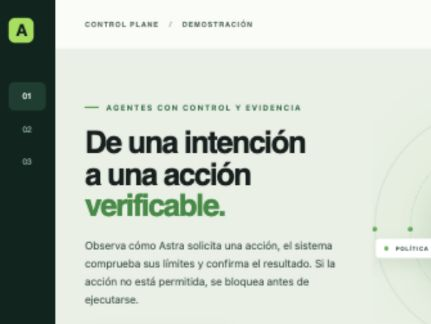

# Autónomo OS

Producto local para profesionales, construido sobre Agent World OS.

[](LICENSE)

Agent World OS is a local prototype for governed AI actions. A model can propose
an action, but the control plane checks authority, resource scope, data flow,
budget, composition policy, and supervision before execution. It then observes
the external result before confirming the effect. SQLite journals control facts
and supports recovery after process death.

The current implementation includes C1–C12, H1 durable runtime, H2 filesystem
effects, H3 local inference, and H4 restricted HTTP/API effects. See
[implementation status](docs/IMPLEMENTATION_STATUS.md) for verified milestones
and limitations.

The supported Node.js version is recorded in [`.nvmrc`](.nvmrc) and enforced by
the project manifests.

## Autónomo OS · correo y CRM

La interfaz PYMES permite preparar una respuesta desde un correo entrante:
propuesta de IA local revisada, cliente y dirección confirmados, borrador
editable, aprobación exacta y envío gobernado. El CRM registra la interacción
y el próximo seguimiento tras confirmar el efecto. La implementación P07 está
probada localmente; su nuevo recorrido completo con Gmail real sigue pendiente
de aceptación. Véanse [avance P07](docs/handoff/AVANCE_P07_FLUJO_CORREO_2026-10-04.md)
y [trabajo pendiente del producto](docs/AUTONOMO_OS_PRODUCT_BACKLOG.md).
Los borradores revisados pueden corregirse mediante una versión sucesora con
aprobación nueva mientras no haya claim de envío: [avance P08](docs/handoff/AVANCE_P08_REVISION_RESPUESTAS_2026-10-04.md).

Estado reciente: [P10 · cancelación durable](docs/handoff/AVANCE_P10_CANCELACION_TRABAJOS_2026-10-04.md) y [P11 · conversaciones y trazabilidad CRM](docs/handoff/AVANCE_P11_CONVERSACIONES_CRM_2026-10-05.md).

## Un espacio para cada profesional

La entrada **Mi jornada** lee la actividad real del CRM y de la cola de revisión.
**Organizar mi espacio** permite elegir una plantilla (profesional independiente,
consultoría o seguros), mostrar módulos y cambiar su orden. La organización se
guarda por propietario y puede exportarse/importarse como JSON para adaptarla
con Claude/Codex. Importar prepara un borrador que debe revisarse y guardarse.
Véanse [entrega y límites](docs/handoff/AVANCE_ESPACIO_MODULAR_2026-10-05.md).

## Cápsulas adaptables

**Cápsulas** permite activar, configurar y desactivar un resumen de
clientes que reutiliza el CRM local. Las decisiones son durables por propietario.
El kit descargable aporta los contratos reales para crear variantes con
Claude/Codex. Véanse [entrega, pruebas y límites](docs/handoff/AVANCE_CAPSULAS_FUNDACION_2026-10-05.md)
y [ejemplo reutilizable](pymes/examples/capsules/README.md).
El SDK v1 admite vistas de lectura; la instalación de código externo sigue pendiente.

## Telegram compartido

El módulo opcional **Telegram** recibe texto del bot en conversaciones autorizadas,
con historial local, búsqueda, ediciones conservadas y recuperación tras SIGKILL.
La credencial se guarda en Keychain; la recepción y el cursor se confirman juntos
en un SQLite separado. La prueba actual usa un proveedor sintético: queda pendiente
la aceptación con un bot real. No incluye envío de respuestas.
Véanse [implementación y puesta en marcha](docs/handoff/AVANCE_TELEGRAM_RECEPCION_2026-10-05.md).

El propietario ya puede verificar un remitente contra un contacto existente del CRM,
consultar su ficha y retirar el vínculo conservando el historial. Las decisiones
usan el journal existente; una revisión obsoleta se rechaza. Véanse
[identidad Telegram y CRM](docs/handoff/AVANCE_TELEGRAM_IDENTIDAD_CRM_2026-10-05.md).

## Install and verify

```bash
npm install
npm test
npm run typecheck --workspaces --if-present
npm run build
npm run check:pymes
npm run check:openclaw-contract
npm run check:k8s
npm run check:product
npm audit --omit=dev --audit-level=high
```

`npm run check:pymes` ejecuta el gate completo del producto PYMES: typecheck,
pruebas y build de la interfaz.
`npm run check:product` añade el contrato OpenClaw y la validación Kubernetes
en una sola orden.
CI añade además el typecheck de todos los workspaces y bloquea la entrega ante
vulnerabilidades altas o críticas en dependencias de runtime.

## Run the demos

The [`pymes`](pymes/README.md) workspace opens the generic professional desk.
Run `npm run demo:pymes` and open `http://127.0.0.1:5174/`. Connect a configured
workspace in Settings to read its durable CRM, review queue and organization.
Without a connection the new home asks for configuration. Legacy fictional
insurance views remain available by direct route (`#morning`, for example).
Gmail is available through the configured pilot; other providers require their
own integration. See the [PYMES deployment guide](pymes/DEPLOYMENT.md).

For a guided company presentation, run `npm run demo:company` and open the
printed `/demo.html` URL. It starts a loopback runtime and a separate Spanish
interface with three live cases: a confirmed move, a confirmed message, and a
denied unregistered purchase request. It needs no local model or external
service. The facts shown come from the local SQLite journal, not preset UI
results. See [company demo guide](docs/COMPANY_DEMO.md).



`npm run demo:h4:lost-response` is self-contained. It starts a separate API
fixture, performs one governed POST, intentionally loses the response, prints
the persisted `UNKNOWN` state, restarts the runtime, reconciles with a GET, and
prints the confirmed state. Its output includes paths to both SQLite databases.
No local model server is required.

For a natural-language demo, start a local Qwen server in one terminal:

```bash
env -u LLAMA_API_KEY -u LLAMA_ARG_API_KEY_FILE \
  llama-server -hf Qwen/Qwen3-4B-GGUF:Q4_K_M \
  --host 127.0.0.1 --port 8080 -c 8192
```

Then run `npm run demo:h4` in another terminal. Qwen proposes
`api.create_record`; the control plane governs a POST to a separate fixture
process and confirms the result by GET. `npm run demo:h3` demonstrates a
governed filesystem write instead. These demos require a locally available
model and `llama-server` executable.

To see the Three.js world, run `npm run dev:runtime` and `npm run dev:world` in
separate terminals, then open the Vite URL. The panel beside Astra polls a
read-only projection of SQLite-backed effects, observations, budget settlement,
and reconciliation decisions. If port 8787 is occupied, start the runtime with
`AGENT_RUNTIME_PORT=8799` and open the Vite URL with `?runtimePort=8799`.
The WebSocket runtime is currently loopback-only; authenticated remote control
is future work. See the [operator console notes](docs/OPERATOR_CONSOLE.md).

## Design boundaries

- The model cannot grant itself authority or choose an arbitrary network URL.
- A successful executor report alone does not prove an external effect.
- An uncertain HTTP outcome is reconciled by read-only lookup. It is never
  blindly redispatched.
- H4 does not claim exactly-once HTTP effects. If the provider cannot prove
  the outcome, an effect may remain `UNKNOWN`.

Read [H4 HTTP/API effects](docs/H4_HTTP_API_EFFECTS.md) and
[durable runtime](docs/H1_DURABLE_RUNTIME.md) for implementation details.

## Licencia

Código y documentación propios publicados bajo la [licencia MIT](LICENSE).
Las dependencias y los modelos externos conservan sus respectivas licencias;
los pesos de modelos, credenciales y datos locales no se incluyen en este repositorio.
