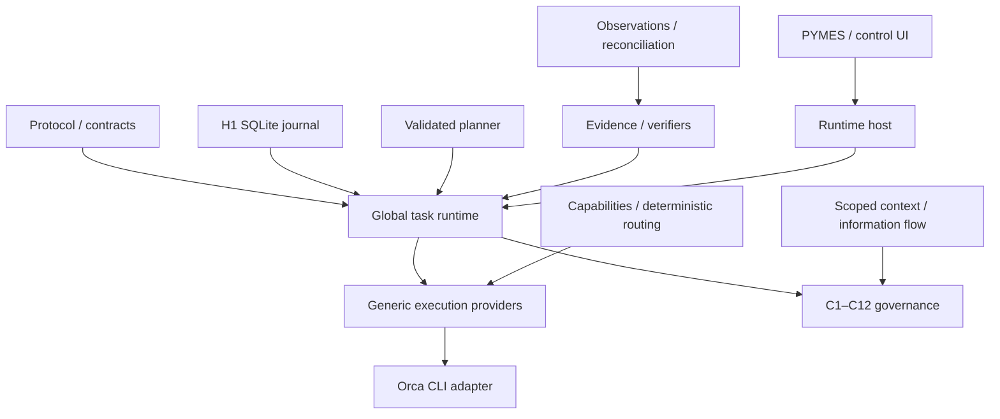

# AW2-0 — Repository audit and architecture map

Audit date: 2026-10-03 (Europe/Madrid). Repository: `/Users/mac/Downloads/agent-world-os`.
Branch: `codex/h4-http-api`. Reference specification:
`/Users/mac/Downloads/AGENT_WORLD_OS_V2_UNIVERSAL_TASK_RUNTIME_CODEX_SPEC.md`.

## Architectural invariant

Models propose. The Global Task Runtime owns state. Policies authorize. Providers execute. Effects change the world. Observations produce evidence. Verifiers determine whether success criteria are satisfied.

## Baseline and working tree

The repository is an npm workspace monorepo (`apps/*`, `packages/*`, `pymes`).
TypeScript uses ES2022, ESNext modules and Bundler resolution. Tests use Node's
runner through tsx; application builds use TypeScript/Vite where configured.
No repository AGENTS.md was found by the audit search.

Commands completed successfully against the actual working tree:

- `npm test`: 515 tests across the declared workspace suites; zero failures
- `npm run typecheck --workspaces --if-present`
- `npm run build`

These workspace commands cover only workspaces declaring the respective scripts.
Existing PYMES edits were already present at audit start, including the compiled
UI service, classifier handler and local-health UI. They are not AW2 kernel work.
Do not fold them into a migration or reset them. No runtime code was changed by AW2-0.

## Existing ownership and reuse map

| Capability | Existing package / source to reuse | V2 boundary |
|---|---|---|
| Shared legacy task/action protocol | `packages/protocol/src/task.ts`, `action-intent.ts`, `runtime-event.ts` | Legacy Task is not GlobalTask; preserve its callers |
| C1 session contracts | `packages/contracts/src/` | Bind each governed attempt to existing scope |
| C2 resources | `packages/resources/src/` | Resolve authorized resource references, not arbitrary provider paths |
| C3 authority/resource leases | `packages/leases/src/fencing.ts`, `resource-lease-store.ts`, `authority-lease-validator.ts` | At most one authoritative attempt; stale reports cannot gain authority |
| C4 budgets | `packages/budgets/src/budget-ledger-store.ts`, `budget-reservation.ts` | Routing and retries must reserve/check through the existing ledger |
| C5 observations | `packages/observation/src/observation-policy.ts`, `observer-registry.ts`, `observation-service.ts` | Separate provider report from independently acceptable evidence |
| C6 effects/idempotency | `packages/effects/src/effect-coordinator.ts`, `effect-transaction.ts`, `idempotency.ts` | Dispatch uncertainty must retain UNKNOWN semantics |
| C7 reconciliation | `packages/reconciliation/src/` | Resolve ambiguous provider/effect outcomes before safe retry |
| C8 composition | `packages/composition-policy/src/composition-engine.ts` | Provider selection cannot bypass composition authorization |
| C9 information flow | `packages/information-flow/src/` | Context envelopes use authorized sources/sinks and scoped releases |
| C10 supervision | `packages/supervision/src/supervisor-engine.ts`, `control-state.ts` | Stop/quarantine/approval state must still gate execution |
| C11 governed runner | `packages/control-plane/src/governed-action-runner.ts`, `commit-gate.ts` | Integrate orchestration through governance, not raw shell shortcuts |
| Completion gate | `packages/control-plane/src/task-completion.ts` | Existing evaluator requires active contract, settled effects and accepted observations; extend rather than replace with worker_done |
| C12 crash recovery | `packages/recovery/src/` | Restore global projections before scheduling/dispatch |
| H1 durable control stores | `packages/runtime-store-sqlite/src/database.ts`, `journal-kernel.ts`, `domain-stores.ts`, `task-store.ts`, `runtime-events.ts` | Reuse durable journal and replay; legacy durable task lacks DAG and attempts |
| H2 file effects | `packages/filesystem/src/executor.ts`, `observer.ts`, `reconciler.ts` | Governed file work and independent disk observation |
| H3 inference | `packages/inference/src/index.ts` | Planning/model proposals remain untrusted inputs |
| H4 HTTP effects | `packages/http-api/src/executor.ts`, `observer.ts`, `reconciler.ts` | Cross-provider API work remains observation backed |
| World/event demo | `packages/world-core`, `packages/event-store/src/index.ts`, `apps/world-client` | JSONL WorldEvent store is not the transactional H1 control journal |
| Runtime host | `apps/agent-runtime` | Integrate the global control loop here after kernel/provider semantics stabilize |
| Insurance product | `pymes` | Keep existing customer workflows; later consume task API, never make browser state authoritative |

The milestone status document records C1–C12/H1–H4 implementation and important
limits. This audit does not treat those historical labels as proof that AW2 is
implemented. The inspected task models contain no global WorkUnit DAG, attempt
history or capability-based provider contract.

## Gaps and staged package plan

1. **AW2-1:** add `packages/task-runtime` with GlobalTask, WorkUnit, Attempt,
   deterministic transitions and durable replay through the H1 journal. Keep
   the old Task API compatible. Unknown/terminal states require explicit rules.
2. **AW2-2:** add `packages/execution-providers` with generic provider contracts,
   typed availability/observations and registries. Provider reports cannot finish
   global work.
3. **AW2-3:** add `packages/provider-orca` with an isolated CLI JSON transport,
   strict decoders and opt-in live verification. No terminal/worktree stack rebuild.
4. **AW2-4–9:** capabilities, deterministic routing, scoped context, decisions,
   artifact/evidence references, independent criteria evaluation, scheduler and
   validated planner. Consolidate modules when ownership remains clear.
5. **AW2-10–13:** governed loop, non-Orca execution, failure/crash matrix and
   inspectable control API/CLI. Bind dispatch to existing effects, leases and budgets.
6. **AW2-14–15:** task UI after stable semantics; learning router disabled/shadow
   first and unable to override hard authorization.

## Dependency direction

Arrows describe integration flow; package imports must remain acyclic. Provider
contracts depend on shared types, not a concrete runtime implementation. The task
kernel must not import Orca or PYMES. Durable projection registration lives in the
host/integration boundary so storage and kernel do not import each other.

## Orca environment audit

`command -v orca` finds `/usr/local/bin/orca`. Both `orca --version` and
`orca --help` exit 1 with:

> Unable to determine Orca.app path from symlink: /usr/local/bin/orca

The launcher is therefore **unavailable**, not a verified execution provider.
No worker was started. CLI JSON schemas and supervised capabilities have not yet
been proven. A valid app installation/launcher is needed for opt-in live AW2-3.
Do not silently substitute an unrelated command named orca.

## Risks and acceptance boundaries

- Do not migrate existing journal command names or invalidate H1 replay history.
- Validate a whole event before mutating projections; reject duplicate/stale IDs,
  cycles, invalid ownership, invalid transitions and concurrent authoritative attempts.
- A reported provider success only permits verification; evidence must prove the
  scoped criteria. Completion from provider prose is forbidden.
- UNKNOWN dispatch is not ordinary failure; preserve its attempt and reconcile.
- Planner context and provider output remain untrusted. Never persist raw credentials.
- Full baseline green is regression evidence, not proof of V2 correctness.
- PYMES and Mac mini 16 GB remain a product deployment target, separate from AW2
  coding-provider validation. Current hardware measurements do not certify 16 GB.

## Next acceptance gate

AW2-1 must prove task creation, rejection of invalid transitions, DAG/reference
replay, active attempt identity, terminal-state protection and preservation of
UNKNOWN, including a fresh-process crash/restart test. Interfaces or TODOs alone
are not a completed kernel. No Orca integration is required in AW2-1.
