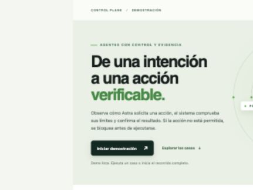

# Company demo

Start from the repository root:

```bash
npm install
npm run demo:company
```

Open the printed local URL, normally
`http://127.0.0.1:5173/demo.html?runtimePort=8799`. Leave that terminal open
throughout the presentation. Press Ctrl+C afterward. The script stores the
demo journal at `/tmp/agent-world-company-demo.db` by default. Set
`DEMO_DB_PATH` to a new absolute path for a clean presentation, or to an
existing demo journal to show persistence. `DEMO_RUNTIME_PORT` and
`DEMO_WEB_PORT` can change the loopback ports.

## Suggested four-minute walkthrough

1. Point out the three boundaries: authority, policy, observation. Explain
   that a requested action is not confirmed until the runtime observes its
   result.
2. Press **Iniciar demostración**. Astra moves to a registered room, sends a
   test message, and attempts an unregistered purchase action. The third case
   is denied without creating an authorized effect.
3. In **Evidencia persistente**, select either confirmed effect to show its
   proposal, admission, dispatch marker, execution, and observation. Show the
   denial code below.
4. Refresh the page. The summary and trace are rebuilt from the SQLite journal.



The interface uses the real local runtime and demo world. It does not contact a
model, a payment service, or any external provider. Counts describe the recent
items displayed by the operator snapshot (up to 20 effects and 20 denials), not
all events in the database. This is a local product demonstration, not a
production deployment; remote access and operator authentication remain future
work.
