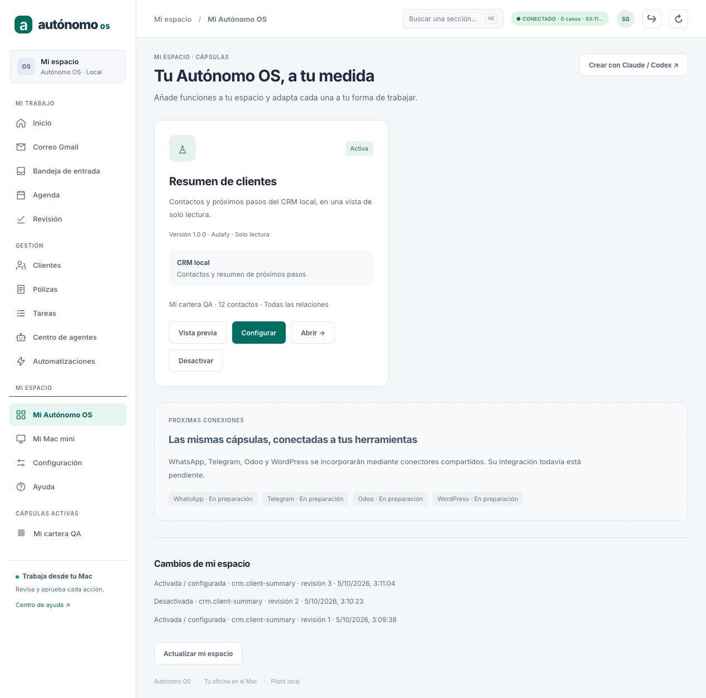
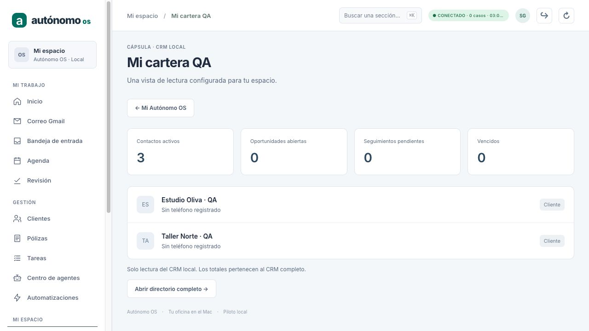
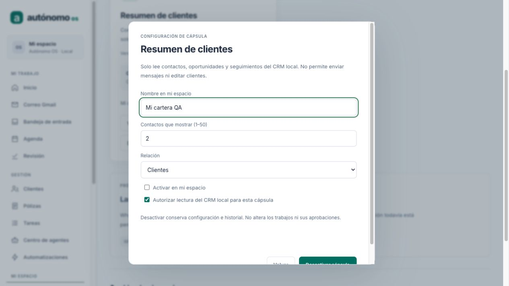
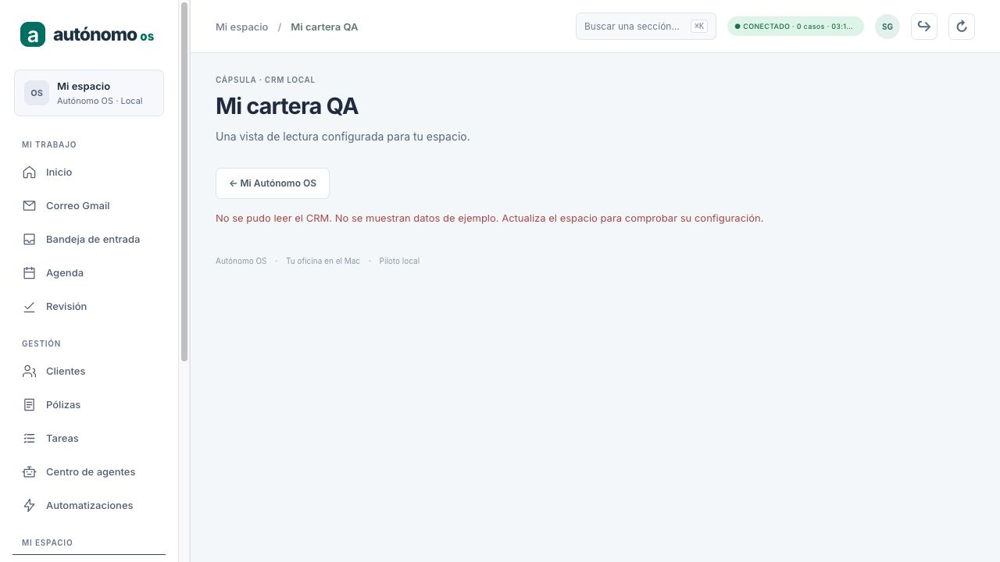
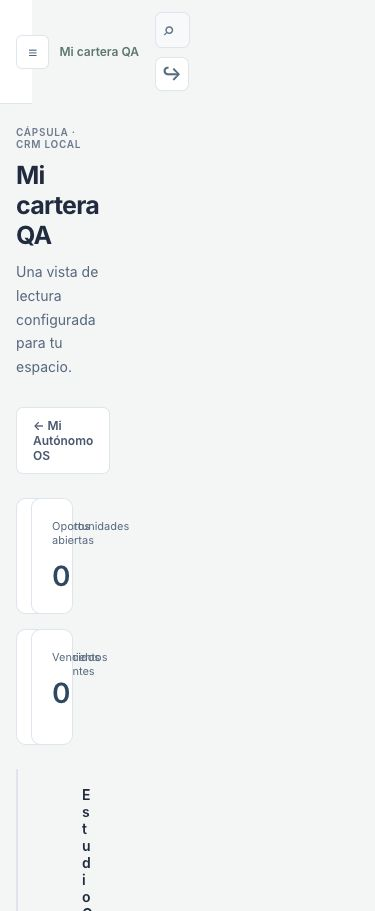

# Autónomo OS · fundamento de cápsulas

Fecha: 5 de octubre de 2026. Licencia: MIT.

Base inspeccionada antes de modificar: `39772ffefd76210adf425e941dcbe1c524e68e60`.
Rama: `codex/h4-http-api`. Checkout: `/Users/mac/Downloads/agent-world-os`.
El SHA de entrega es el commit que incorpora este documento; puede consultarse
con `git log -1 --format=%H -- docs/handoff/AVANCE_CAPSULAS_FUNDACION_2026-10-05.md`.
La copia entregada en Downloads registra también el SHA concreto al finalizar.

## 1. Resultado utilizable

**Mi Autónomo OS** permite previsualizar, activar, configurar, abrir y desactivar
la primera cápsula, **Resumen de clientes**. El profesional elige su nombre,
entre 1 y 50 contactos y el filtro Todos / Clientes / Prospectos. Debe consentir
la lectura del CRM local antes de activar. La cápsula aparece en su navegación
y en el buscador de secciones.

Los contactos y los totales proceden del CRM existente del propietario. No se
crea otro CRM. La vista previa usa ejemplos explícitamente sintéticos; la vista
activada no los utiliza como sustituto ante un fallo.

El botón **Crear con Claude / Codex** descarga `KIT_CAPSULA_AUTONOMO_OS.md`, con
los archivos reales completos `capsule-sdk.ts` y `crm-contract.ts`, un manifest
editable e instrucciones de revisión y pruebas. El archivo descargado desde
el navegador se comprobó contra ambos archivos del checkout: coinciden.

## 2. Contratos y archivos

| Archivo | Función |
| --- | --- |
| `pymes/src/capsule-sdk.ts` | SDK declarativo v1, validación estricta, configuración, contratos del cliente y proyección de contactos |
| `pymes/src/capsule-registry.ts` | Registro de definiciones revisadas incluidas en el build; identidad y versión |
| `pymes/src/capsule-store.ts` | Configuración por tenant/owner, revisión, recibo idempotente e historial atómicos en SQLite |
| `pymes/src/capsule-api.ts` | Autenticación y autorización del propietario; catálogo, configuración y lectura CRM |
| `pymes/src/capsule-kit.ts` | Exportación de los contratos y ejemplo sin datos del workspace |
| `pymes/src/capsule-screen.ts` y `.css` | Catálogo, modal, vista CRM, navegación y errores explícitos |
| `pymes/examples/capsules/prospect-summary.ts` | Segunda definición reutilizable, registrada en los tests, no en producción |
| `pymes/examples/capsules/README.md` | Cómo revisar, registrar y verificar una variante |

Cambios de integración limitados a `index.html`, `main.ts`, `navigation.ts`,
`workspace-client.ts`, `workspace-api.ts` y `runtime-source.ts`.

### API

Todas las rutas exigen Bearer válido, rol owner y tenant correcto. El propietario
lo obtiene el host de la sesión autenticada; no se acepta desde el payload.

```text
GET  /v1/workspaces/<tenant>/capsules
POST /v1/workspaces/<tenant>/capsules/configure
GET  /v1/workspaces/<tenant>/capsules/<capsuleId>/view
```

La configuración exige `commandId`, `expectedRevision`, `capsuleId`, `version`,
`enabled`, `grants` y `config`. Campos desconocidos, código, scopes adicionales,
recursos ajenos o SDK incompatible se rechazan.

El único renderer v1 es `crm.contact-summary`; el recurso es
`crm.local.contacts`. `database.query` reutiliza el nombre de capacidad existente,
pero el adaptador lo limita a una proyección autorizada del CRM. Este manifest
no entrega SQL ni crea una autorización general en C12. No ejecuta efectos
externos ni recibe credenciales.

## 3. Persistencia, idempotencia y recovery

- Archivo: `<ruta-runtime>.capsules.db`; para `runtime.db`,
  `runtime.db.capsules.db`. En memoria se utiliza otro store en memoria.
- SQLite WAL, `synchronous=FULL`, archivo privado 0600 y tenant vinculado.
- `BEGIN IMMEDIATE` y revisión esperada impiden perder cambios entre escritores.
- Instalación, revisión, comando, recibo y auditoría se guardan en la misma
  transacción. Repetir el comando exacto devuelve su recibo guardado. Reutilizar
  el identificador con otro contenido se rechaza.
- El actor y el timestamp se fijan en servidor. Se conserva todo el historial;
  el catálogo devuelve las últimas 30 decisiones.
- El catálogo se lee dentro de una transacción para conservar coherencia entre
  revisión, configuración y auditoría.
- Una versión nueva del registro no actualiza silenciosamente la instalación.
  La versión anterior queda en el historial y la vista se bloquea hasta una
  confirmación explícita. Repetir un comando ya comprometido sigue siendo
  idempotente aunque la versión disponible haya cambiado.
- Desactivar bloquea el endpoint de contenido y retira la entrada del menú.
  Conserva configuración e historial y se permite también si el CRM falla.

La configuración está separada del journal C1–C12. No añade objetos a sus
snapshots ni modifica tareas, revisiones, aprobaciones, claims C6, UNKNOWN,
COMMITTED, envíos, interacciones o seguimientos.

### Copias de seguridad

El nuevo SQLite debe incluirse en una copia completa de la instalación.
Con el servicio detenido, copiar también su archivo junto con los demás stores.
Una copia en caliente debe usar el mecanismo de backup de SQLite; copiar solo
`runtime.db` o solo un `.db` abierto sin su WAL no es una copia completa.
El empaquetado y la aceptación de backup/restore de todo el producto siguen
pendientes; esta entrega demuestra reapertura y recovery del store de cápsulas.

## 4. Verificación ejecutada

Entorno: macOS, Node `v26.9.0`, dependencias existentes del checkout.

Antes de escribir código: **109/109** tests relevantes de CRM, conversaciones,
trazabilidad y cliente workspace, sin fallos.

Nuevos tests: **16/16**, de los que dos usan procesos hijos y SIGKILL real:

- SDK, manifest ejecutable, scopes/recursos excesivos, límites, campos extra y
  contaminación del prototipo.
- Identidades duplicadas, rutas diferentes y definiciones independientes.
- Persistencia, aislamiento tenant/owner, concurrencia por revisión,
  idempotencia, conflictos y actualización explícita de versión.
- API sin sesión, reviewer, tenant ajeno y sesión revocada.
- Lectura del CRM real sintético, derivación del ejemplo, ausencia de mutaciones
  del CRM/kernel y reapertura con replay del runtime existente.
- Desactivación, recurso fallido, desactivación durante fallo y errores sin demo.
- Validación del cliente y exactitud de contratos exportados.
- SIGKILL **antes** de COMMIT: reapertura conserva revisión 1 y la instalación
  activa; reintento compromete una única desactivación en revisión 2.
- SIGKILL **después** de COMMIT: reapertura conserva revisión 2 y desactivación;
  reintento devuelve el mismo recibo y no duplica la decisión.

Los tests de crash verifican que el proceso alcanza el hook sin que el timeout
sea quien lo mate; el resultado observado es SIGKILL.

### Gates finales

```bash
npm test
npm run typecheck --workspaces --if-present
npm run build
git diff --check
```

Resultado: **979 tests, 978 pasan, 0 fallan, 1 omitido, 0 cancelados**.
El omitido es el probe real de Orca, que requiere opt-in. Workspace PYMES:
**584/584**. Typecheck y build de todos los workspaces pasan.

## 5. Prueba visual reproducible

QA separado: API `127.0.0.1:8938`, UI `127.0.0.1:5181`, tenant `capsules-qa`,
propietario `qa-owner`, tres contactos ficticios. No utiliza Gmail, Keychain,
datos del piloto, modelos ni comunicaciones externas.

Desde la raíz, en dos terminales:

```bash
cd pymes
node --import tsx tests/fixtures/capsules-browser-qa.ts /tmp/autonomo-capsules-qa 8938
```

```bash
cd pymes
npx vite --host 127.0.0.1 --port 5181 --strictPort
```

Abrir:

```text
http://127.0.0.1:5181/?workspaceApi=http%3A%2F%2F127.0.0.1%3A8938&tenant=capsules-qa#settings-screen
```

Clave **exclusivamente sintética de QA**: `capsules-qa-token-123456789`.
Conectar con el formulario. Después abrir **Mi Autónomo OS**.

Recorrido comprobado:

1. Vista previa marcada como ficticia; guardado sin consentimiento rechazado.
2. Activar «Mi cartera QA», filtro Clientes, límite 2; aparecen solo los dos
   clientes, con totales generales del CRM de 3 contactos.
3. Desactivar; se retira del menú, conserva revisión e historial; URL directa
   muestra que no está disponible.
4. Reiniciar la API de QA y recargar: sigue desactivada. Reactivar mediante una
   decisión nueva: revisión 3, configuración e historial conservados.
5. Descargar el kit desde el botón; verificar fuentes exactas en Downloads.
6. En la terminal QA escribir `error`: cierra el CRM del proceso. Recargar la
   cápsula: error real sin filas anteriores ni sustitución por ejemplos.
7. Reiniciar QA para restaurar la vista; probar viewport móvil 390×844:
   métricas en dos columnas, filas legibles y sin desbordamiento horizontal.
   Se restableció el viewport del navegador al terminar.

Se corrigieron durante esta revisión visual el CSS que ocultaba el modal,
los botones que quedaban deshabilitados tras guardar y el nombre accesible
del enlace dinámico, que anunciaba el icono en vez del título.

### Capturas











## 6. Límites y siguientes entregas

Esta entrega es el fundamento funcional del sistema de cápsulas. Aún faltan:

- Extraer los módulos heredados a cápsulas y plantillas de profesión. Algunos
  menús de seguros y pantallas de demostración siguen en el shell existente.
- Más renderers y contratos de formularios/modelos/acciones. Actualmente solo
  se pueden derivar vistas de lectura del CRM; no se instala código arbitrario
  ni archivos enviados por el navegador.
- Instalación, dependencias, migraciones, actualización/rollback y aislamiento
  para código de terceros; no hay sandbox general ni marketplace remoto.
- Más permisos y revocación granular para recursos adicionales. Por ahora
  desactivar bloquea toda la cápsula y conserva el consentimiento histórico.
- Paginación completa de contactos. La vista reutiliza el listado CRM actual,
  limitado a 200; el resumen muestra hasta 50 y avisa de los recortes.
- Adaptador MCP Apps/host. Se ha investigado su SDK; no se ha integrado ni se
  afirma compatibilidad con ese estándar en esta entrega.
- Conectores compartidos Telegram, WhatsApp, Odoo y WordPress; las tarjetas
  indican «En preparación». No se han instalado dependencias externas nuevas.
- Validación comercial en Mac mini 16 GB / MacBook 24 GB, instalación firmada,
  backup/restore completo y aceptación real pendiente del flujo M4 de Gmail.

Orden propuesto: extraer un módulo existente con este contrato; añadir el
primer conector de Telegram en lectura con cuenta de prueba; ampliar contratos
para acciones gobernadas; estudiar MCP Apps y aislamiento antes de admitir
código externo. Cualquier escritura conservará aprobación exacta y el flujo
de reconciliación; tener una tool MCP disponible no acredita su recuperación.
