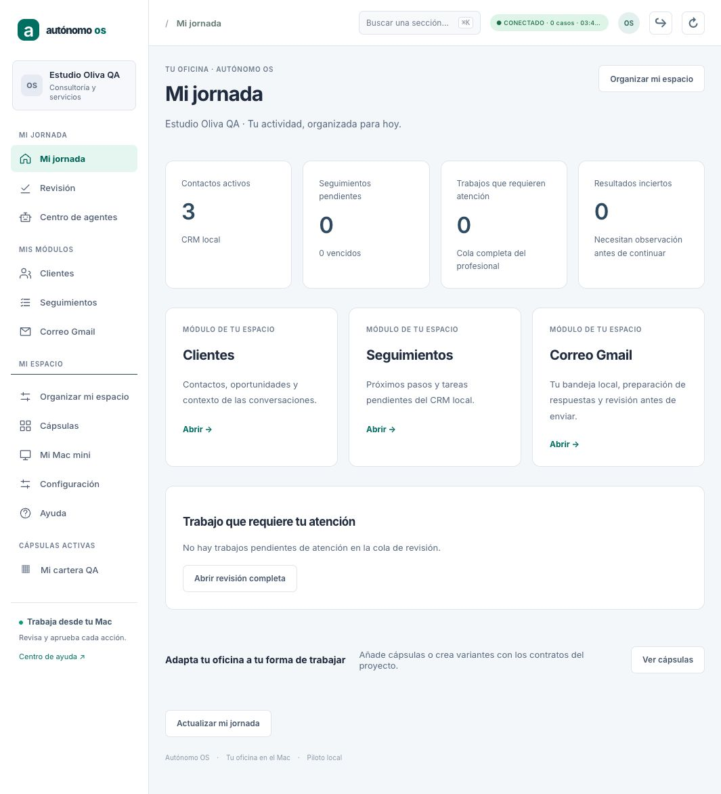
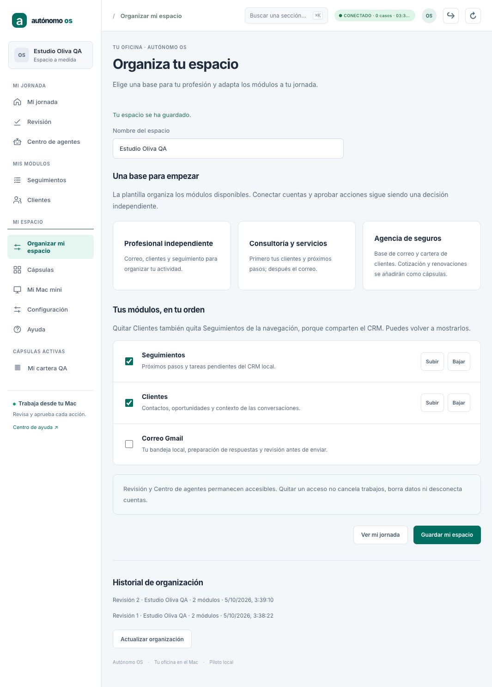
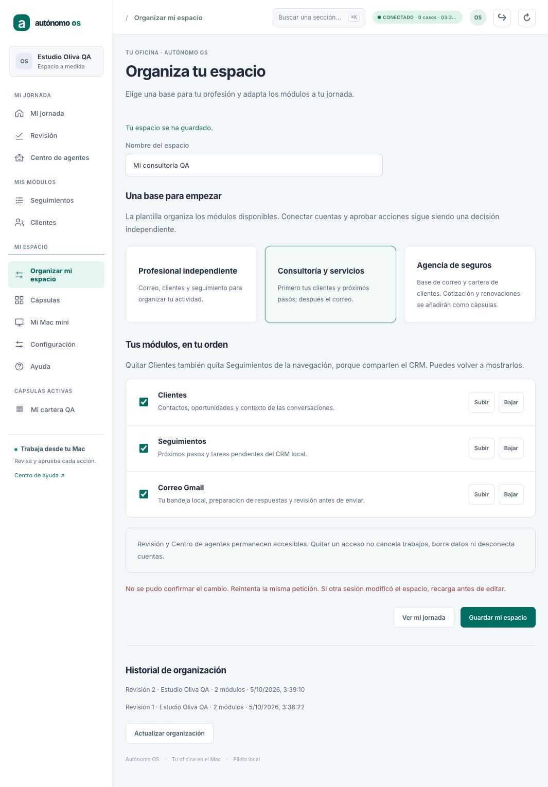
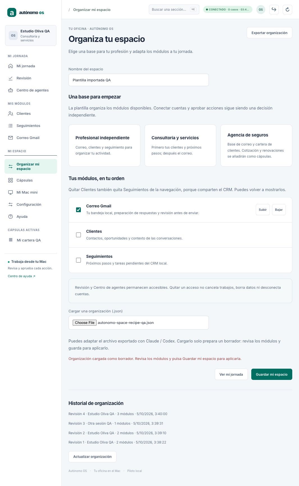
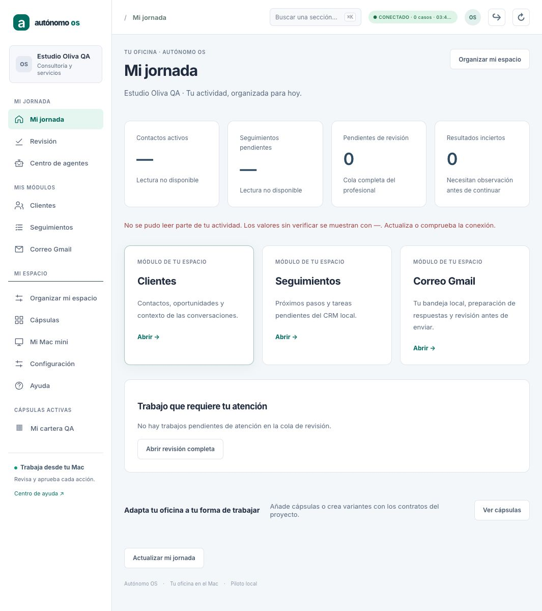
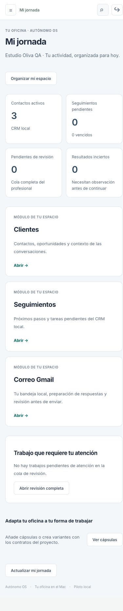

# Autónomo OS · espacio modular y jornada profesional

Fecha: 5 de octubre de 2026. Licencia MIT.
Checkout: `/Users/mac/Downloads/agent-world-os`.
Rama: `codex/h4-http-api`.
Base inspeccionada: `91718a597448f09e47a310473848ad7d98a676c1`.
El SHA de entrega se obtiene con:

```bash
git log -1 --format=%H -- docs/handoff/AVANCE_ESPACIO_MODULAR_2026-10-05.md
```

La copia en Downloads incluye el SHA concreto después del commit.

## Resultado

La app abre **Mi jornada**, una oficina genérica que lee el CRM local y la cola
de revisión del propietario. Muestra contactos, seguimientos pendientes/vencidos,
trabajos que requieren atención y resultados inciertos. Si falla una lectura,
su valor es «—» y aparece un aviso; no se sustituye por datos de ejemplo ni cero.
La cola muestra hasta cinco entradas y enlaza con la revisión completa.

**Organizar mi espacio** permite:

- Nombrar el espacio.
- Elegir Profesional independiente, Consultoría y servicios o Agencia de seguros.
- Mostrar y ordenar Correo Gmail, Clientes y Seguimientos.
- Exportar la organización guardada como JSON y cargar otra como borrador.
- Revisar y guardar explícitamente ese borrador.
- Consultar las últimas 30 decisiones de organización.

Las plantillas ordenan los módulos implementados. La de seguros no incorpora
tarifadores ni renovaciones reales. El catálogo **Cápsulas** conserva la primera
cápsula CRM, su consentimiento, configuración y kit Claude/Codex.

El menú y el buscador se construyen con los módulos elegidos y las cápsulas
activas. **Revisión** y **Centro de agentes** siempre permanecen accesibles.
Las vistas heredadas ficticias de seguros siguen disponibles por rutas directas,
pero no son la jornada inicial ni aparecen como módulos activos en el buscador.

## Contratos y persistencia

| Archivo | Función |
| --- | --- |
| `pymes/src/space-contract.ts` | Módulos y plantillas revisados, validadores, dependencias y receta portable |
| `pymes/src/capsule-store.ts` | Perfil, revisión, comando, recibo y auditoría atómicos por propietario |
| `pymes/src/space-api.ts` | Sesión owner y tenant; propietario derivado de la sesión |
| `pymes/src/workspace-client.ts` | Lectura, configuración y validación de respuestas |
| `pymes/src/space-screen.ts` y `.css` | Jornada, editor, historial, navegación y errores |
| `pymes/tests/space.test.ts` | Contratos, persistencia, API, aislamiento y preservación del runtime |
| `pymes/tests/space-crash.test.ts` | Procesos hijos y SIGKILL antes/después de COMMIT |

```text
GET  /v1/workspaces/<tenant>/space
POST /v1/workspaces/<tenant>/space/configure
```

Configurar exige `commandId`, `expectedRevision`, `name`, `templateId` y `modules`.
Campos ajenos, código, rutas, scopes, módulos desconocidos y dependencias
incompletas se rechazan. Seguimientos requiere Clientes; la UI añade/quita
las dependencias coherentemente.

Se añaden `space_profiles` y `space_commands` al SQLite existente de cápsulas
(`<runtime>.capsules.db`), sin modificar el journal C1–C12. Las revisiones de
organización y cápsulas son independientes. La transacción `BEGIN IMMEDIATE`
guarda perfil, revisión, petición, recibo y evidencia de actor/timestamp juntos.
Repetir una petición exacta devuelve el mismo recibo. Reutilizar su ID con otro
contenido o escribir sobre una revisión antigua produce conflicto.

El historial completo permanece en disco; la API presenta las últimas 30
decisiones. La migración es aditiva y preserva instalaciones de cápsulas.
SQLite continúa usando WAL, `synchronous=FULL` y archivo privado 0600.

**Esta configuración organiza la presentación.** Ocultar un módulo no revoca
permisos de API, desconecta cuentas, cancela trabajos ni elimina datos. No hay
claims de envío nuevos ni cambios en C6/UNKNOWN/COMMITTED, aprobaciones, replay,
CRM o Gmail. El acceso a recursos mantiene los contratos existentes.

## Receta portable

El botón **Exportar organización guardada** descarga
`AUTONOMO_OS_ORGANIZACION.json` con `schemaVersion: 1` y `settings`:
nombre, plantilla y módulos ordenados. Exporta el perfil guardado, no un borrador
sin aplicar. No incluye tokens, propietario, tenant, historial ni datos del CRM.

La importación acepta exclusivamente ese esquema y un máximo de 8 KB; el texto
se valida y no se ejecuta como código. Preparar un borrador no cambia el perfil
durable ni el menú. Cambiar de sesión o recargar descarta el borrador pendiente.
Claude/Codex puede adaptar el JSON dentro de los módulos revisados disponibles.
Esto no es todavía un instalador de cápsulas externas.

## Pruebas ejecutadas

macOS, Node `v26.9.0`, dependencias existentes; sin dependencias nuevas.
Baseline relevante antes de escribir: **111/111**.
Nuevas pruebas: **12/12**, de ellas dos con SIGKILL real:

- Validación estricta, dependencias, orden y receta portable sin código/permisos.
- Persistencia, recibos idempotentes, revisión concurrente y aislamiento owner/tenant.
- Esquema aditivo con instalación anterior conservada.
- API sin sesión, reviewer, tenant ajeno, spoofing de owner y sesión revocada.
- Organización sin módulos que conserva trabajo durable, CRM, grants de cápsula
  y snapshot del kernel; reapertura/replay conserva el trabajo y la organización.
- Cliente rechaza tenant cruzado, historial incoherente y recibos incompatibles.
- SIGKILL antes de COMMIT: conserva la revisión anterior; reintento guarda una
  sola decisión nueva. Después de COMMIT: conserva la nueva; reintento devuelve
  el mismo recibo. Se comprueba que el timeout no causó la muerte del proceso.

Gates completos ejecutados:

```bash
npm test
npm run typecheck --workspaces --if-present
npm run build
git diff --check
```

**991 tests, 990 pasan, 0 fallan, 1 omitido, 0 cancelados.** El omitido es
el probe real de Orca, condicionado a opt-in. PYMES: **596/596**.
Typecheck y build de todos los workspaces pasan.

## QA visual aislado

API `127.0.0.1:8938`, UI `127.0.0.1:5181`, tenant `capsules-qa`, usuario
`qa-owner`, tres contactos sintéticos. No se usan Gmail, Keychain, modelos,
clientes reales ni comunicaciones externas.

Reutiliza el fixture del fundamento de cápsulas:

```bash
cd pymes
node --import tsx tests/fixtures/capsules-browser-qa.ts /tmp/autonomo-capsules-qa 8938
```

En otra terminal:

```bash
cd pymes
npx vite --host 127.0.0.1 --port 5181 --strictPort
```

Abrir:

```text
http://127.0.0.1:5181/?workspaceApi=http%3A%2F%2F127.0.0.1%3A8938&tenant=capsules-qa#settings-screen
```

Conectar con la clave exclusivamente sintética `capsules-qa-token-123456789`.
Recorrido acreditado en navegador:

1. Elegir plantilla, nombre y módulos; guardar; menú refleja el orden elegido.
2. Reiniciar solo la API QA y recargar: persiste la organización.
3. Reordenar Clientes/Seguimientos y guardar otra revisión.
4. Escribir `space-race` en la terminal QA mientras existe un borrador: otra
   sesión modifica el perfil durable. Guardar desde la revisión anterior se
   rechaza realmente (409), conserva el borrador y no sobrescribe el perfil.
5. Actualizar y desmarcar Clientes: Seguimientos también se desmarca.
6. Guardar Consultoría; jornada muestra tres contactos reales del fixture,
   cola vacía verificada y módulos en el orden CRM/Seguimientos/Gmail.
7. Buscador contiene las secciones actuales y la cápsula activa, sin menús
   heredados de seguros. Vista móvil legible, sin desbordamiento horizontal.
8. Cargar JSON con nombre distinto y solo Gmail: cambia el borrador; sidebar e
   historial siguen en revisión 4. Exportar conserva el perfil guardado.
   Se verificó el archivo descargado en Downloads.
9. Escribir `error` en QA cierra el CRM de verdad. Actualizar jornada muestra
   contactos y seguimientos como «—», con aviso; mantiene el cero de revisión
   comprobado por su lectura independiente. Reiniciar QA restaura la vista.

El viewport temporal se restableció. La API piloto 8907 no se reinició.
Se corrigió durante QA que un error de guardado habilitaba controles de orden
que estaban en el límite; se conservan ahora sus estados anteriores.

### Capturas













## Pendiente

- Convertir los módulos actuales en paquetes de cápsulas completos. Ahora se
  organiza su navegación sin sustituir sus contratos de aplicación.
- Más renderers, formularios y acciones gobernadas en el SDK; instalación,
  migraciones, dependencias, actualización/rollback y sandbox de código externo.
- Conectores compartidos Telegram, WhatsApp, Odoo y WordPress; recepción,
  identidad, consentimiento y almacenamiento antes de habilitar escrituras.
- MCP Apps/host y catálogo de terceros; no integrados en esta entrega.
- Aceptación real nueva del flujo M4 de Gmail, Google Calendar, CRM externo y
  funciones específicas de seguros.
- Instalación/actualización firmada, backup/restore integral (incluido este
  SQLite), mediciones en Mac mini 16 GB/MacBook 24 GB y permisos de producción.

El desarrollo continúa; esta entrega no declara el producto comercial terminado.
