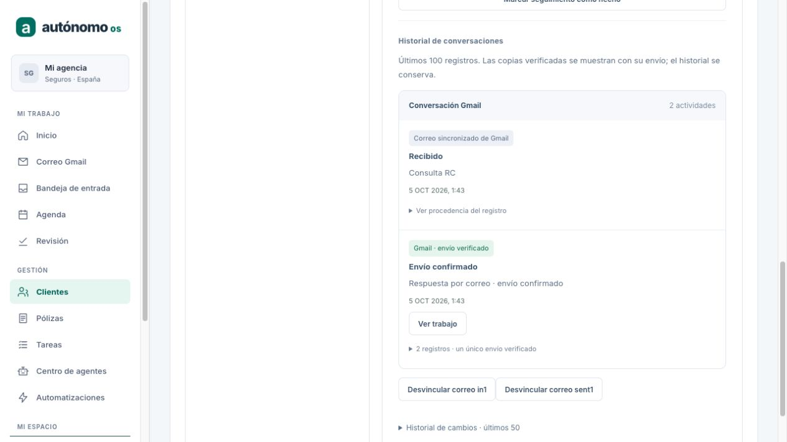
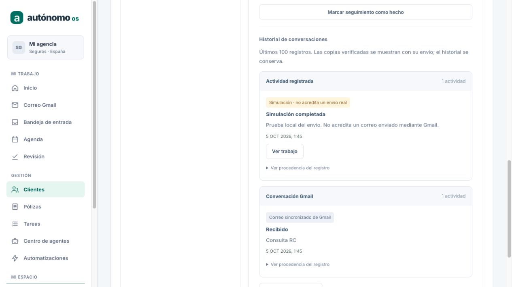
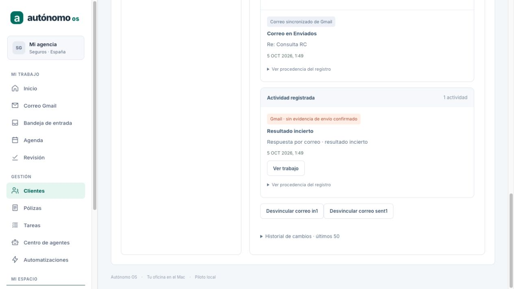
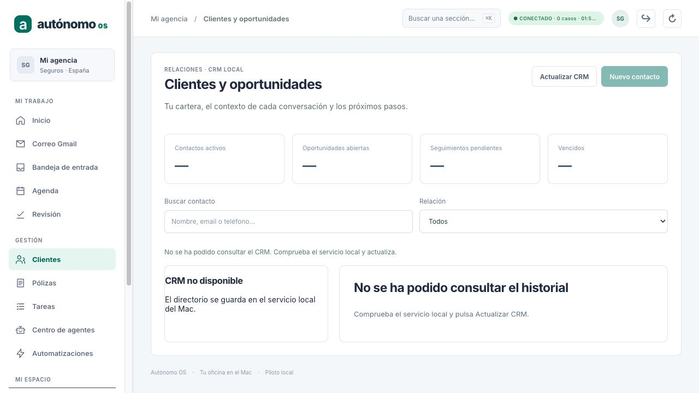

# P11 — Conversaciones y trazabilidad de correo en CRM

Fecha: 2026-10-05. Checkout: `/Users/mac/Downloads/agent-world-os`.
Rama: `codex/h4-http-api`. Base limpia: `6efd289c7fb0c97a05673010d2c1ac185994e37d`.

## Resultado y alcance

Continuación del backlog después de cerrar P10. Conversaciones en la ficha del
cliente, procedencia histórica del proveedor y asociación verificable entre el
envío gobernado y la copia sincronizada de Gmail. Implementación y QA sintético;
no se declara una nueva aceptación M4 contra Google real.

SHA del código validado: **e47388ab79ef9104f877209f195ddf57ef4f0693**.
El commit posterior añade este informe, capturas, README y backlog. El SHA final
se comunica en la entrega y se añade a la copia de Downloads tras el commit.

## Implementación

- `crm-mail-trace.ts`: lector del journal que exige revisión del propietario,
  aprobación exacta, intent ligado a su bindingHash, payload exacto, efecto y
  observación del mismo subject/recursos/postcondición. Solo usa observaciones
  vinculadas al efecto o a la decisión vigente de reconciliación. Una evidencia
  confirmada de `gmail-email`, no simulada, debe contener un único ID Gmail
  acreditado y el hash exacto del payload. Conflicto de recibos no acredita envío.
- La clasificación nunca usa el proveedor actualmente configurado. Una
  simulación se reconoce por el contexto `fake-email` durable de su tarea o
  evidencia histórica del proveedor. Un registro antiguo sin suficiente
  procedencia queda «Proveedor histórico sin acreditar».
- `EmailReviewStore.reviewForIntent`: lectura de una revisión ligada a su intent;
  evita copiar todos los cuerpos del historial por cada interacción. No cambia
  ningún comando registrado ni resultado de replay.
- `CrmService.conversationView`: añade metadatos solo a la copia de lectura del
  CRM. Consulta credenciales locales, namespace, contenido local disponible y
  pertenencia de tenant/owner/cuenta. Comprueba de nuevo el contexto y la sesión
  antes de publicar; un cambio concurrente produce un error real.
- `GET /v1/workspaces/<tenant>/crm` incorpora `interaction.trace`. No hay nuevas
  rutas de escritura ni scopes. Los comandos CRM no aceptan procedencia forjada.
- `crm-view.ts`: valida procedencia y referencias en el navegador. Una respuesta
  inconsistente es error, sin sustitución por datos de ejemplo.
- `crm-conversations.ts`: agrupación pura por contacto + accountRef + threadId.
  Combina visualmente una copia outgoing/committed de Gmail con exactamente un
  efecto committed acreditado con el mismo Gmail ID, cuenta y thread. Cada
  entrada conserva todos sus registros e IDs. Coincidencia de asunto, cuerpo,
  destinatario o Message-ID nunca basta. Ambigüedad mantiene entradas separadas.
- `crm-screen.ts/css`: tarjetas de conversación, estado/proveedor, procedencia
  desplegable y «Ver trabajo». Simulación no presenta el texto heredado de
  «envío confirmado» como envío real; el original sigue en procedencia. Error de
  CRM elimina la vista anterior, muestra «CRM no disponible», mantiene reintento
  y no sustituye el contenido por demo ni un mensaje de carga permanente.

## Invariantes conservados

C1–C12, journal, replay, Governed Runner, C6/UNKNOWN, proveedor Gmail M3, Keychain,
P03–P10 y sus operaciones durables siguen intactos. No hay nuevo sender, kernel,
store o transición de estado. El CRM conserva su revisión, auditoría,
interacciones y seguimientos originales.

UNKNOWN no se convierte en COMMITTED por ver una copia en Enviados. Permanece
separado hasta la observación/reconciliación existente; P11 no observa Gmail ni
reenvía. No añade un seguimiento de envío confirmado a UNKNOWN. Cancelar P10
sigue sin registrar envío y mantiene sus bloqueos y reglas de reprepare.

Cambiar de cuenta oculta thread y punteros de la anterior, aunque la evidencia
histórica del envío permanece en el CRM de su propietario. Desconectado permite
consultar el historial local conforme al contrato P04. Purga elimina punteros
locales y agrupación, conservando auditoría/recibos del journal; no pretende
borrar toda la historia CRM ni backups.

## Pruebas ejecutadas

Baseline antes de cambios: **60/60** pruebas de cancelación, revisión, CRM y correo.
P11 añade **18** pruebas:

- 6 de agrupación, separación por ID/cuenta/contacto/thread, UNKNOWN, ambigüedad,
  parser del cliente y presentación de simulaciones/registros sin acreditar.
- 2 de evidencia: 12 alteraciones negativas de subject/proveedor/payload/estado,
  evidencia no utilizada, identidad ajena, recibos conflictivos y legado.
- 8 de integración: Gmail adapter con HTTP sintético, copia en Enviados,
  idempotencia, ausencia de mutaciones al consultar, replay, UNKNOWN →
  reconciliación sin reenvío, cuenta/owner/tenant, desconexión, sesión revocada,
  credencial cambiada durante lectura, purga y simulación incluso UNKNOWN.
- 2 SIGKILL reales: hijo con COMMITTED y con UNKNOWN durable; restart reconstruye
  la misma vista y un execute repetido no realiza otro POST. UNKNOWN se
  reconcilia con evidencia sintética y conserva una sola llamada de envío.

Los fixtures usan únicamente direcciones `example.test`, secretos sintéticos,
TestVault en memoria y bases QA separadas. El transporte de Gmail es falso;
no se usan mensajes ni datos reales del piloto como fixtures.

| Gate | Resultado |
| --- | --- |
| `npm test` | **963 descubiertas; 962 pasan; 0 fallan; 1 omitida; 0 canceladas** |
| PYMES | **568/568 pasan** |
| `npm run typecheck --workspaces --if-present` | exit 0 |
| `npm run build` | exit 0 |
| `git diff --check` | exit 0 |

La omitida sigue siendo la prueba live opcional de Orca, no una prueba P11.
Los números se suman de los resúmenes por workspace, no de una suite parcial.

## QA visual aislado

Con la skill cua-driver y el navegador integrado se revisaron tres bases separadas:
`p11-qa-gmail`, `p11-qa-simulation`, `p11-qa-unknown`, bajo
`/Users/mac/Library/Application Support/Autonomo OS/`. API QA 8936; interfaz 5177.
Cada sender sintético realizó una sola llamada. API QA cerrada al terminar.

Comprobado: conversación recibida/respuesta (3 registros, 2 actividades),
procedencia expandida conserva ambos IDs, «Ver trabajo» abre la tarea correcta,
simulación visible, UNKNOWN separado con cero seguimientos de envío, y error
409 real de CRM tras cerrar únicamente CrmService conserva el workspace conectado
pero vacía la ficha y métricas. También se observó fallo de conexión al apagar
la API; no aparecen clientes ni historial de ejemplo.

Capturas sin datos reales:









Reproducir con un directorio vacío y el piloto UI en 5177:

```bash
node --import tsx pymes/tests/fixtures/crm-conversations-browser-qa.ts /ruta/qa gmail
# Alternativas: simulation, unknown. Puerto 8936 exclusivo para QA.
# Controles por stdin: status; error (cierra CRM); revoke; stop.
# Token exclusivamente sintético mostrado por el fixture al iniciar.
```

## Servicio del piloto

Backup SQLite consistente y privado antes de reiniciar:
`/Users/mac/Library/Application Support/Autonomo OS/m3-pilot/backup-before-p11-runtime.db`.
Servicio 8907 reiniciado con el código P11; interfaz 5177 conserva acceso.
La cola tras restart mantiene **4 trabajos: 3 completados y 1 UNKNOWN legado**.
No se ejecutó envío, reconciliación, cancelación ni preparación en el piloto.

## Límites y siguiente trabajo

1. Agrupación visual de los últimos 100 registros, no deduplicación destructiva
   ni paginación completa. La API mantiene las interacciones históricas crudas;
   no usar su cantidad como métrica de «emails enviados».
2. Un recibo puede acreditar envío aunque la copia local aún no esté sincronizada,
   esté purgada o no sea legible. Sin copia local no hay puntero ni agrupación.
3. La vista no abre todavía el correo directamente desde la ficha ni muestra
   todo el cuerpo de la conversación. Ese incremento necesita una navegación
   que respete el contexto y la selección autorizada del inbox.
4. Evidencia histórica no es nueva consulta a Google ni acreditación real de M4.
   Queda la aceptación controlada del flujo entrante → revisión → respuesta/CRM,
   cambios de etiquetas y retención. Envío nuevo requiere aprobación exacta.
5. Se mantiene un único escritor del runtime journal, como P10. No certifica
   múltiples procesos escritores. El inbox conserva su fencing independiente.
6. Agenda diaria, Google Calendar, seguros/renovaciones, canales, CRM externo,
   instalación/actualización/backup comercial y evaluación en Mac 16/24 GB
   siguen en el backlog. Nuevos permisos Google requieren decisión explícita.

P12 no iniciado en esta entrega.
