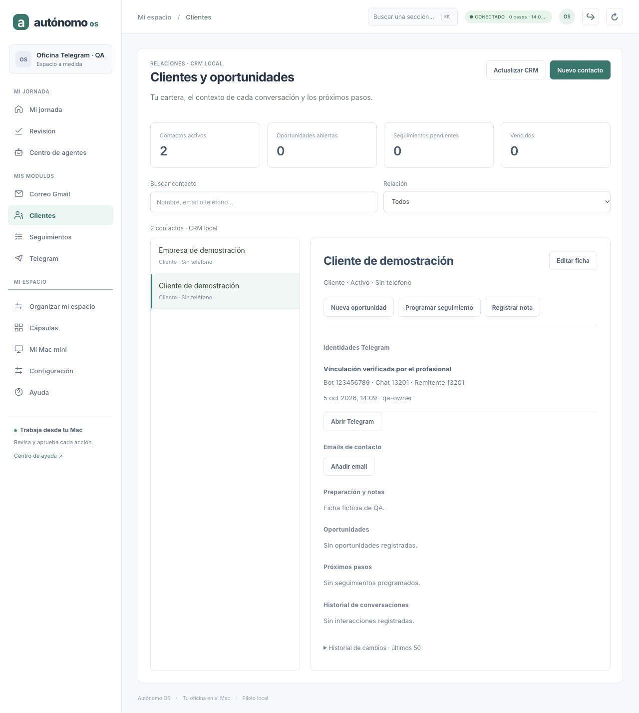

# Autónomo OS · identidad Telegram y CRM

Fecha: 5 de octubre de 2026. Checkout: `/Users/mac/Downloads/agent-world-os`.
Base limpia inspeccionada: `a71e2f685fd716233df852b67b473cd7f5a11927`.
Rama: `codex/h4-http-api`. Licencia MIT. Sin dependencias nuevas.

## Implementado

El propietario puede confirmar que el remitente de un mensaje recibido corresponde
a un contacto **existente y activo** del CRM. El vínculo se define por IDs numéricos
de **bot + chat + remitente**; no por nombres, alias, email supuesto o igualdad de texto.

La UI presenta **Identidad actual del remitente**, permite buscar un contacto,
exige confirmación explícita, admite una nota opcional y muestra actor/fecha e
historial. Desde Telegram se abre la ficha del cliente. La ficha CRM muestra las
vinculaciones verificadas y retiradas de las conversaciones actualmente autorizadas.

Retirar una asociación conserva el registro original, la decisión de retirada y
los mensajes. Asociar a otro contacto exige retirar primero y hacer una nueva
verificación. No existe sustitución automática ni reactivación silenciosa.

Esta entrega valida comportamiento local/sintético, no aceptación con Telegram real.
No implementa importación de mensajes como interacciones ni workflow de respuesta.

## Arquitectura y persistencia

| Archivo | Función |
| --- | --- |
| `pymes/src/telegram-identity-contract.ts` | Comandos y validación estricta de vistas/recibos |
| `pymes/src/telegram-identity-store.ts` | Proyección determinista, revisión, idempotencia, vínculos e historial |
| `pymes/src/telegram-identity-service.ts` | Comprueba evidencia local, autorización, contacto y revisiones; transacción journal |
| `pymes/src/telegram-identity-screen.ts` | Consulta de identidad, diálogo de verificación/retirada, búsqueda e historial |

Cableado en runtime/API/cliente, detalle Telegram y ficha CRM. El store de Telegram
aporta lectura de un evento consentido y un guard de contexto del sidecar.

Se registra **`pymesTelegramIdentities.apply`** en el JournalKernel existente,
antes del restore, incluso cuando Telegram no está habilitado. Sus decisiones van
al **journal del runtime**, con replay y digests existentes. No añade otra base de
identidades ni cambia la proyección CRM de email. El transporte, Keychain,
recepción y cursor del conector anterior conservan su comportamiento.

### Consistencia

- Comando exacto con commandId, expectedRevision de identidad, crmRevision,
  connectionRevision, botId, updateId observado, operación, contactId/linkId,
  reviewed:true y nota.
- Tenant/actor se obtienen de la sesión propietaria; el cliente no puede inventarlos.
- El servidor extrae chatId/senderId/messageId del evento persistido y consentido.
  Texto/nombre del remitente no se copian al journal de identidad.
- Se verifica revisión de la ficha CRM y estado activo antes de una asociación nueva.
- Se mantiene un `BEGIN IMMEDIATE` de lectura en el sidecar durante la decisión
  del journal: otro proceso no puede cambiar cuenta/política durante su persistencia.
  La operación no escribe datos en el sidecar y no necesita commit de dos bases.
- Vínculo y auditoría pertenecen a una única mutación del journal, envuelta en su
  transacción. La autorización se revalida inmediatamente antes de mutar.
- Repetir exactamente una petición confirmada devuelve el recibo original sin
  añadir otra decisión. Alterar su contenido bajo el mismo commandId se rechaza.
- Una revisión obsoleta de identidad, CRM o cuenta se rechaza. La retirada exige el
  linkId actual para no retirar una asociación más reciente.
- Un contacto archivado conserva la asociación histórica y puede retirarse;
  no admite una verificación nueva mientras esté archivado.

C1–C12, journal/replay, Governed Runner, C6/UNKNOWN, Gmail M3 y P03–P11 mantienen sus
contratos. Los tests comprueban que asociar identidades no cambia snapshot de tasks/
effects ni contactos, oportunidades, interacciones y seguimientos del CRM.

## API

Prefijo autenticado: `/v1/workspaces/<tenant>/telegram`.

- `GET /identity?botId=<id>&updateId=<id>`: vínculo actual, contacto e historial
  del remitente observado. No modifica la proyección.
- `POST /identity`: verifica o retira una asociación local con revisión explícita.
- `GET /identities?contactId=<id>`: historial para la ficha CRM, hasta 100 vínculos,
  con total/truncated. Solo bot/chats autorizados actuales; sin cuerpos de mensajes.

La vista del remitente muestra hasta 20 decisiones recientes. Una cuenta diferente,
chat retirado o update descartado no permite consultar ni verificar esa identidad.
Desconectar recepción conserva consulta local y asociaciones del bot actual.
Una repetición exacta ya confirmada puede devolver su recibo tras un cambio de
configuración: confirma una decisión histórica, sin ejecutar otra ni exponer mensajes.

## UI/UX

- Verificación expresa del profesional, diferenciada del nombre proporcionado por
  Telegram. No se presenta como verificación independiente de la identidad civil.
- Buscador de contactos con lista de resultados reales y aviso al superar 200.
  No crea contactos automáticamente; para una ficha nueva se usa Clientes.
- Al cambiar de candidato/búsqueda se limpia la confirmación marcada.
- Errores reales del CRM o de identidad se muestran sin datos de ejemplo.
- La respuesta asíncrona se descarta si cambian selección, sesión o contexto.
- El polling de Telegram conserva los nodos cuando la vista no cambia; la identidad
  se consulta por separado y no repinta si su respuesta sigue igual. Evita interrumpir
  clics y conserva el historial desplegado. Una búsqueda en edición conserva el foco.
- Todos los nombres/notas/textos se renderizan como texto, sin interpretar HTML.

## Verificación realmente ejecutada

Equipo: macOS y Node v26.9.0.

- Baseline previo: **125/125** (Telegram, CRM, conversaciones y cliente workspace).
- Pruebas relevantes tras integrar: **137/137** (Telegram, CRM y cliente; conjunto
  diferente al baseline, sin el fichero de conversaciones).
- **18 tests nuevos**: 15 de identidad/contratos/API y 3 de SIGKILL.
- Suite completa: **1033 tests, 1032 pasan, 0 fallan, 1 omitido**.
- PYMES: **638/638**.
- Omitido existente: probe Orca real opt-in.
- `npm run typecheck --workspaces --if-present`: correcto.
- `npm run build`: correcto.
- `git diff --check`: correcto.

Cobertura: consentimiento humano, campos exactos, source no falsificable por el
cliente, actor/evidencia, idempotencia y conflictos, revisiones obsoletas, ediciones
/futuros eventos del mismo remitente, otro chat/participante con mismo nombre,
retirada y nueva asociación, retirada obsoleta, contacto archivado, desconexión,
política retirada, cambio de bot, update descartado, aislamiento tenant/owner/role,
sesión revocada en el guard final, runtime cerrado, contratos de navegador y replay
tras un arranque con el conector deshabilitado. Se comprueba además un commandId
`toString` para evitar colisiones con propiedades heredadas de objetos.

### SIGKILL real

El proceso hijo se mata de verdad mediante hooks locales:

1. **Antes de persistir**: al restaurar no hay vínculo ni decisión.
2. **Dentro de la transacción**, después del mutador pero antes del COMMIT exterior:
   el journal revierte al morir el proceso; no hay vínculo ni decisión.
3. **Después del COMMIT**: el journal restaura un vínculo y una decisión.

Los watchdogs no disparan el kill. Repetir la petición dos veces después del restart
produce una única decisión. Un segundo restart conserva el resultado. El kernel
mantiene revisión 0 y el CRM conserva los dos contactos sintéticos sin duplicados.
No se invoca envío, Gmail, inferencia ni Keychain real en estas pruebas.

### QA visual aislada

API 8940, UI 5181, tenant `telegram-qa`, fixtures en
`/tmp/autonomo-telegram-browser-qa`. Gmail piloto 8907 sin modificar.

Verificado: búsqueda/contacto, confirmación, vínculo visible, abrir ficha CRM,
retirada con historial, restart, nueva revisión y estado recuperado. Un cambio
real del CRM mientras el diálogo está abierto provoca rechazo de la confirmación.
Cerrar el servicio real de identidad en QA muestra error y retira el vínculo de
la vista; los mensajes del inbox siguen visibles. Al reiniciar se recupera la
asociación desde el journal. El historial desplegado permanece abierto tras polling.
La comprobación móvil 390×844 da ancho/scrollWidth 390, sin desbordamiento.

Capturas en `docs/handoff/captures/telegram-crm-2026-10-05/`:

- `01-confirmacion.jpg`: decisión explícita con contacto elegido.
- `02-vinculada.jpg`: identidad verificada en Telegram.
- `03-ficha-crm.jpg`: vínculo en la ficha, sin interacciones inventadas.
- `04-retirada-historial.jpg`: retirada y prueba anterior conservadas.
- `05-conflicto-crm.jpg`: rechazo real por cambios en la ficha durante revisión.
- `06-error-identidad.jpg`: error real sin sustitución de datos.
- `07-recuperacion.jpg`: tres decisiones recuperadas e historial abierto.
- `08-movil.jpg`: identidad y auditoría en móvil.



## Límites y próximos incrementos

1. La UI muestra la **identidad actual del remitente**, incluso al abrir un mensaje
   antiguo. No reasigna interacciones históricas, porque todavía no las crea.
   Los vínculos anteriores permanecen en su contacto original y auditoría. Una
   importación futura debe fijar procedencia/contacto por evento, sin reescribirlo
   silenciosamente cuando cambie una asociación.
2. No identifica automáticamente personas, no usa usernames para fusionar contactos
   y no autoriza decisiones comerciales o envíos por haber verificado un vínculo.
3. No crea leads, seguimientos ni tareas desde Telegram. Siguiente trabajo: reutilizar
   los contratos de propuestas/revisión del runtime para preparar trabajo desde una
   conversación, con evidencia y aprobación según el efecto.
4. Sigue pendiente piloto con bot real, retención/purga del inbox y política de nueva
   época de updateId tras inactividad, ya descritos en la entrega del conector.
5. No hay envío Telegram. Su diseño futuro necesita conservar UNKNOWN y demostrar
   cómo se observa el resultado; un retry ciego no es una reconciliación.
6. Vínculos/nota opcional van al journal; se conservan también tras retirada. Borrado
   integral y política de retención/backup requieren un incremento específico.
7. Capacidad acotada de decisiones y listas: no se oculta truncamiento de resultados.
8. **Compatibilidad de rollback:** después de escribir comandos de esta proyección,
   un binario anterior que no registre `pymesTelegramIdentities` rechazará el replay
   (UNKNOWN_STORE_COMMAND). Mantener la proyección registrada en futuras versiones,
   también con conector deshabilitado. No hacer downgrade sobre ese journal;
   rollback requiere una versión compatible o restaurar un backup anterior completo.
9. Convertir módulos a cápsulas SDK, instalación/adaptación de código, WhatsApp,
   Odoo y WordPress siguen en el backlog general.

## SHA final

El commit que incorpora este documento es la entrega. Puede consultarse con:

```bash
git log -1 --format=%H -- docs/handoff/AVANCE_TELEGRAM_IDENTIDAD_CRM_2026-10-05.md
```

La copia de Downloads incluye el SHA completo después del commit.
