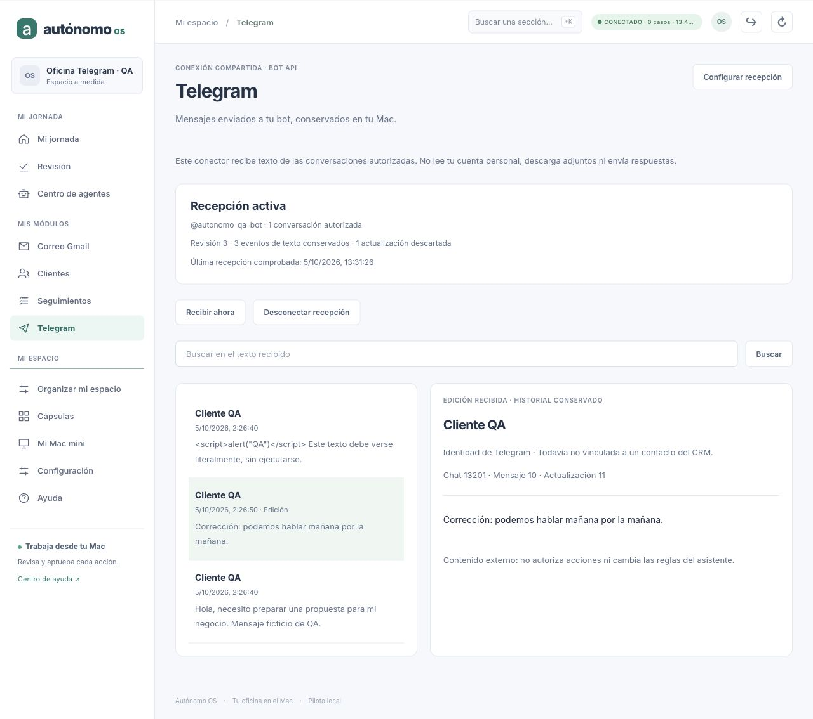

# Autónomo OS · Telegram compartido: recepción durable

Fecha: 5 de octubre de 2026. Base inspeccionada: `49efca52ca81467e7c9194c844eae77e553b3a46`.
Rama: `codex/h4-http-api`. Repositorio: `/Users/mac/Downloads/agent-world-os`.
Licencia del proyecto: MIT. No se ha importado código de terceros ni añadido dependencias.

## Resultado

Primer conector compartido del espacio modular: recepción de texto mediante la
Bot API oficial, inbox local y pantalla propia. Implementado y probado contra un
proveedor sintético; **no acreditado todavía con Telegram real ni Keychain real**.
Gmail M3 conserva su aceptación previa. C1–C12, el journal/replay, Governed Runner,
C6/UNKNOWN y P03–P11 no se modifican.

El módulo se muestra desde **Organizar mi espacio → Telegram**. Las plantillas
existentes conservan sus valores iniciales. Varias vistas pueden reutilizar este
conector único; todavía no es una cápsula descargable ni un servidor MCP.

## Implementación

| Archivo en `pymes/src` | Responsabilidad |
| --- | --- |
| `telegram-contract.ts` | Configuración, consentimiento, decisiones y validación estricta de respuestas |
| `telegram-transport.ts` | HTTP a destino fijo, timeout/cancelación, respuestas acotadas y normalización |
| `telegram-store.ts` | SQLite independiente, alcance, historial, cursor, leases y decisiones CAS |
| `telegram-service.ts` | Configurar/desconectar, vault, polling único, backoff y limpieza de claves obsoletas |
| `telegram-api.ts` | Rutas autenticadas de propietario, aislamiento y errores sin secretos |
| `telegram-view.ts` | Selección visible, autorizada y ligada a la revisión actual |
| `telegram-screen.ts` / `.css` | Configuración, recepción, búsqueda, lista/detalle, desconexión y estados reales |

Cableado mínimo en servidor/runtime/API/cliente/navegación/organizador. La API local
solo habilita Telegram cuando `PYMES_TELEGRAM_ENABLED=1` y host `127.0.0.1`.

### API

Prefijo: `/v1/workspaces/<tenant>/telegram`, Bearer del propietario.

- `GET` al prefijo: estado, sin secretos.
- `GET /messages?q=&limit=&cursor=`: página local, máximo 50 eventos.
- `POST /connect`: `commandId`, `expectedRevision`, `token`, `allowedChatIds`, `consent: true`.
- `POST /disconnect`: `commandId`, `expectedRevision`.
- `POST /sync` con `{}`: inicia recepción y devuelve 202; no significa recepción completada.

No hay ruta de envío. La misma decisión repetida conserva una única revisión y
entrada de auditoría. Otro payload bajo el mismo commandId se rechaza.

## Invariantes

1. Credencial solo en `CredentialVault` (Keychain en el servidor normal). SQLite
   conserva una referencia opaca y un digest de idempotencia, nunca el token.
   El formulario mantiene el token temporalmente para verificar y reintentar;
   se limpia al terminar/cancelar/cambiar sesión. No va a prompts, logs ni exportación.
2. SQLite separado: `<PYMES_RUNTIME_DB_PATH>.telegram-inbox.db`, WAL, FULL,
   permisos 0600; una vinculación persistente tenant/propietario por sidecar.
3. Un polling por servicio y lease durable de 90 segundos con fencing de revisión.
   El escritor caducado o sustituido no publica datos.
4. Lote entero validado antes de guardar. Eventos, recibos de descarte y offset
   se confirman juntos. El siguiente `getUpdates` usa el offset confirmado;
   **esa llamada confirma/consume actualizaciones en Telegram**. No es GET-only.
5. No se guarda texto de chats no autorizados: solo recibo de descarte con ID y
   digest del objeto normalizado sin contenido. Adjuntos no se descargan.
6. Cada update es inmutable por bot/updateId; una edición es otro evento y conserva
   el original. Una contradicción en un ID conocido rechaza el lote completo.
7. Identidad y ausencia de webhook se comprueban antes de recibir. Nunca se llama
   a `deleteWebhook`, `setWebhook` ni `sendMessage`.
8. Revocación de sesión durante una petición, desconexión o cambio de configuración
   impiden publicar el lote. Desconectar conserva el historial local y cancela el poll.
9. Cambiar de bot aísla su inbox. Retirar un chat de la política oculta sus eventos
   conservados; no los purga. Volver a autorizarlo permite verlos de nuevo.
10. Cursor ligado a bot, consulta, revisión de contenido y configuración; un cursor
    obsoleto se rechaza. Detalle solo del elemento visible y autorizado.
11. Datos del proveedor se pintan con textContent. Ante fallo real de lectura API
    se vacían lista/detalle; no se sustituyen por fixtures.
12. No crea contactos, interacciones de envío, seguimientos ni trabajos del kernel.

### Credenciales y limpieza

Se reutiliza `MacKeychainVault` y el helper Swift existente. Su servicio Keychain
sigue llamándose `com.autonomo-os.gmail`, con referencias Telegram distintas
(derivadas de namespace, tenant, propietario y UUID). No se cambia la credencial Gmail.
Antes de escribir una clave se reserva una referencia en un outbox durable.
Al confirmar configuración se retira la reserva actual y se encola la anterior.
Si falla el borrado de una clave obsoleta, se reintenta al arrancar y cada minuto,
aun con recepción desconectada, en lotes de tres. Reservas sin conexión publicada
esperan dos minutos. Las referencias actuales quedan excluidas de la limpieza.
Si el llavero permanece indisponible, la limpieza queda pendiente sin deshacer la
configuración confirmada. No se usa un vault de fichero como fallback.

## Puesta en marcha en un Mac

Desde el checkout:

```bash
npm run gmail:build-keychain --workspace=@agent-world/pymes
```

En la configuración privada del servidor, conserva las variables existentes de
workspace y usa:

```dotenv
PYMES_API_HOST=127.0.0.1
PYMES_TELEGRAM_ENABLED=1
PYMES_TELEGRAM_KEYCHAIN_HELPER=/Users/mac/Downloads/agent-world-os/pymes/data/bin/gmail-keychain
```

Arranca con `npm run api --workspace=@agent-world/pymes`. Conecta la interfaz a esa
API usando su sesión de propietario. En el organizador activa Telegram, abre
**Configurar recepción** e introduce un bot dedicado y los IDs numéricos de chats
verificados y consentidos. **No pongas el token del bot en CLI, .env, repo o chats.**
Un bot con webhook activo se rechaza; el operador debe decidir cómo separarlo de
su instalación anterior. Se recomienda bot exclusivo por instalación: otro poller
puede consumir actualizaciones antes de que Autónomo OS las vea.

La recepción automática usa long polling de hasta 20 segundos y una pausa mínima
de un segundo tras éxito; persiste espera tras error y respeta retry_after de 429.
Errores de autorización, credencial, webhook o conflicto de poller detienen el
polling automático hasta corregir/reconectar. Bot API no da lectura de todos los
chats de una cuenta personal.

## Pruebas realmente ejecutadas

Equipo actual: macOS, Node v26.9.0.

- Baseline relevante previo: **111/111**.
- Telegram y organizador: **36/36**, incluidos 24 tests nuevos de Telegram.
- Suite completa: **1015 tests, 1014 pasan, 0 fallan, 1 omitido**.
  Omitido existente: probe Orca real, opt-in; no relacionado con Telegram.
- PYMES dentro de esa suite: **620/620**.
- Typecheck de todos los workspaces: correcto.
- Build de todos los workspaces: correcto.
- `git diff --check`: correcto.

Cobertura: consentimiento y contratos, destino fijo, redacción de errores,
respuesta limitada, webhook/conflicto/429, vault y escaneo DB+WAL sin token,
idempotencia/CAS, ámbito propietario/tenant, batch rollback, duplicados/contradicciones,
leases, revocación durante red, cursor obsoleto, ediciones, desconexión con poll activo,
backoff persistente y outbox de credenciales (también limpieza automática desconectada).
Se comprueba que CRM y snapshot del kernel siguen iguales durante recepción.

### SIGKILL y recuperación

Dos tests matan de verdad el proceso hijo con SIGKILL: inmediatamente antes y
tras COMMIT del lote. Reinician sobre el mismo SQLite. El primero vuelve a pedir
el offset inicial; el segundo pide el offset 11 ya confirmado. En ambos queda
un único evento. El watchdog no provoca el kill: lo provoca el hook probado.
La expiración del lease se verifica avanzando un reloj controlado; no se han
esperado 90 segundos reales. No se invoca ningún método de envío.

### QA visual aislada

API QA 8940, UI 5181, tenant `telegram-qa`, vault/proveedor sintéticos, datos en
`/tmp/autonomo-telegram-browser-qa`. Piloto Gmail 8907 sin modificar.

Verificado mediante navegador: conectar con consentimiento, activar módulo,
recibir tres eventos/descartar uno, texto HTML literal sin script, edición con
original conservado, búsqueda sin resultados limpia detalle, desconectar conserva
historial, reiniciar conserva estado, reconectar sin duplicados, búsqueda sin perder
foco durante polling y vista móvil 390×844 sin overflow. Cierre real del store en
API QA causa error visible y vacía datos. Después se restaura la API y el historial.

Capturas en `docs/handoff/captures/telegram-2026-10-05/`:

- `01-recepcion.jpg`: contenido externo literal.
- `02-filtro-sin-detalle.jpg`: filtro vacío.
- `03-desconectado.jpg`: historial conservado.
- `04-edicion.jpg`: edición seleccionada.
- `05-movil.jpg`: layout móvil.
- `06-error-api.jpg`: error real sin demo.
- `07-final.jpg`: estado restaurado final.



## Límites y siguiente trabajo

- Solo texto de mensajes/ediciones de private/group/supergroup con usuario remitente;
  canales, eventos sin from, remitentes bot, multimedia y demás tipos se descartan.
- No vincula Telegram ID/username automáticamente al CRM. Siguiente incremento:
  identidad verificada por operador y trazabilidad hacia el contacto, sin duplicados.
- Sin clasificación IA ni respuesta gobernada desde Telegram todavía. Una pérdida
  de respuesta de un futuro sendMessage no permite asumir reintento seguro:
  exigir contrato de evidencia/reconciliación antes de habilitar envío.
- Bot API conserva actualizaciones pendientes como máximo 24 horas. Estar offline
  más tiempo puede perder esa ventana; no es un archivo completo de Telegram.
- Telegram puede elegir un updateId aleatorio tras una semana sin actualizaciones.
  El conector no resetea offsets automáticamente ante IDs inferiores: necesita una
  política explícita de nueva época/cursor. No promete continuidad en ese caso.
- Inbox y sidecar se guardan en claro con permisos locales. Retención, purga específica,
  exportación, backup/restore de todos los sidecars y empaquetado firmado quedan pendientes.
- Una cuenta propietaria/bot activo por instalación. No hay multicuenta simultánea,
  webhook público, Telegram Business ni conector de sesión personal.
- Falta piloto Telegram real: getMe, conservación de IDs, mensajes/ediciones,
  reinicio con Keychain, webhook/concurrencia y control de contenido descartado.
- WhatsApp/Odoo/WordPress y extracción de módulos a cápsulas siguen en backlog;
  una API/MCP deberá adaptarse a contratos reales y conservar gobierno de efectos.

Fuentes técnicas consultadas: [Bot API](https://core.telegram.org/bots/api#getupdates)
y [FAQ oficial](https://core.telegram.org/bots/faq). El contrato HTTP actual es pequeño
(tres métodos); no requiere traer otro runtime de agentes ni SDK externo.

## SHA de entrega

El commit que incorpora este documento es la entrega; para obtener su SHA completo:

```bash
git log -1 --format=%H -- docs/handoff/AVANCE_TELEGRAM_RECEPCION_2026-10-05.md
```

La copia en Downloads se completa con el SHA verificado después del commit.
