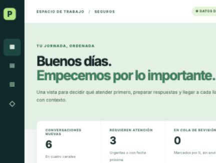

# PYMES · agente de trabajo para seguros

El historial de cambios del producto está en [CHANGELOG.md](CHANGELOG.md).

Esta carpeta inicia un producto vertical para una agencia o correduría de
seguros. El problema inicial es la primera hora de cada mañana: mensajes
dispersos, incidencias, solicitudes de propuesta, renovaciones, citas y cambios
en expedientes. El primer prototipo convierte un conjunto ficticio de mensajes
en una bandeja priorizada, borradores y una agenda de solo lectura.
Los mensajes sin contacto reconocido permanecen en la bandeja como casos
pendientes de identidad; no reciben un borrador personalizado ni ficha CRM.

El entorno soportado es Node.js 22 o superior. El repositorio aplica esta
restricción automáticamente durante `npm ci`.

El piloto está configurado para España y cubre coche, vida, hogar y
responsabilidad civil para autónomos. Holded es el CRM de referencia y Google
Calendar el calendario previsto. Ambos siguen **sin conexión real**.

## Ver el prototipo

Desde la raíz del repositorio:

```bash
npm install
npm run demo:pymes
```

Antes de abrir una versión o desplegar cambios, ejecuta el gate completo:

```bash
npm run check --workspace=@agent-world/pymes
```

Desde la raíz también se puede ejecutar `npm run check:pymes`.

El mismo gate se ejecuta automáticamente en GitHub Actions mediante
`.github/workflows/pymes-ci.yml` para cada cambio que afecte a PYMES.

Abrir `http://127.0.0.1:5174/`. Se puede filtrar por canal, buscar un contacto,
revisar el contexto CRM y marcar un borrador para revisión. Todo se queda en la
sesión del navegador. La cola permite volver a los casos marcados; los mensajes
sin identidad se añaden automáticamente. Cada caso muestra una ficha de
preparación de llamada con preguntas pendientes y, cuando existe, la próxima
cita del cliente. El operador puede corregir intención y ramo con un motivo;
la prioridad de una incidencia comunicada no baja solo por cambiar su etiqueta.
Las solicitudes de propuesta tienen una ficha por ramo para marcar datos
preliminares verificados durante esta sesión. Si la identidad no está vinculada,
las casillas se bloquean. Para vida, el cuestionario de la aseguradora se
muestra como paso externo y esta demo no recoge datos de salud. Completar la
ficha no equivale a obtener una cotización: faltan tarifador, condiciones y
revisión de una oferta real.
Los nombres y mensajes son ficticios. WhatsApp, Telegram,
iMessage, correo, CRM y calendario aparecen como fuentes y destinos previstos;
**aún no hay conexiones reales**.
Las pestañas de canales de la bandeja se generan desde la configuración
compartida de canales soportados.

## API local de workspace

Para desplegar con configuración reproducible, copia [.env.example](.env.example)
y consulta la [guía de despliegue](DEPLOYMENT.md). También puedes usar
[Docker Compose](docker-compose.yml) con un volumen persistente para SQLite.

La primera API de PYMES se puede ejecutar con un token de desarrollo explícito:

```bash
PYMES_API_BOOTSTRAP_TOKEN='cambia-este-token-en-desarrollo' npm run api --workspace=@agent-world/pymes
```

Expone bandeja, aprobaciones, transiciones, auditoría y efectos externos
gobernados. El contrato completo está en [API.md](API.md). El servidor persiste
el estado multiusuario en SQLite y no arranca sin un token de arranque de al
menos 16 caracteres.

La interfaz conectada muestra un panel operativo con casos pendientes,
operaciones activas, fallos y aprobaciones, junto con la hora de sincronización.
Si la marca temporal supera cinco minutos, la interfaz muestra los datos como
desactualizados para evitar decisiones sobre una conexión caída.
El endpoint `GET /v1/workspaces/:tenant/metrics` devuelve solo esos contadores,
sin contenido de mensajes ni payloads. También publica alertas cuando hay
operaciones fallidas, una cola de más de 20 casos o casos `pending_review` con
más de 24 horas sin actualizar. Para supervisores existe
`npm run check:operations`; para Kubernetes, `npm run check:k8s` valida el
overlay antes de aplicarlo.
La cola `GET /v1/workspaces/:tenant/attention` permite a paneles externos leer
solo los casos `pending_review` o `uncertain`, ordenados por antigüedad y con un
límite de 100 registros. La demo usa la bandeja remota como fallback solo cuando
un workspace antiguo responde `404`; los errores de autenticación o servicio no
se silencian.

Variables principales:

```bash
PYMES_API_PORT=8790
PYMES_API_HOST=127.0.0.1
PYMES_API_DB_PATH=./data/pymes-workspace.db
PYMES_API_VERSION=0.1.0
PYMES_API_CORS_ORIGINS=http://127.0.0.1:5174,http://localhost:5174
PYMES_API_BOOTSTRAP_TENANT=demo-agency
PYMES_API_BOOTSTRAP_USER=demo-owner
PYMES_OPENCLAW_CHANNELS=whatsapp,telegram,imessage,email
```

Los tokens bootstrap y de ingress deben tener entre 16 y 4.096 caracteres
efectivos. Los identificadores bootstrap se limitan a 200 caracteres.

Comprueba la instalación con `GET /healthz` antes de conectar la interfaz.

Cuando la interfaz está conectada a un workspace remoto muestra `Cerrar
sesión`; ese control revoca el token en el API y elimina la credencial local.
El contexto inicial marca Holded y Google Calendar como `lectura preparada`:
los adaptadores read-only están disponibles, pero la conexión de una cuenta
externa se confirma únicamente cuando el workspace remoto aparece conectado.
Los estados de conector están tipados y solo admiten `lectura preparada`,
`conectado` o `no configurado`.
También muestra `Actualizar` para volver a leer casos, aprobaciones y efectos
sin recargar la aplicación; el control se bloquea mientras la sincronización
está en curso para evitar peticiones duplicadas. Mientras permanece abierta,
la interfaz repite esa sincronización cada 60 segundos y conserva el mismo
bloqueo para no solapar operaciones.
Los controles de workspace tienen foco visible y el estado de conexión se
anuncia como región viva; la interfaz respeta además `prefers-reduced-motion`.
Cuando la conexión falla varias veces, el indicador conserva el número de
fallos consecutivos en pantalla y en su tooltip, junto con el HTTP status,
`Retry-After` y `X-Request-Id` cuando están disponibles.
Las peticiones del cliente usan 10 segundos por defecto; se puede configurar
`requestTimeoutMs` entre 100 y 60.000 ms y capturar
`WORKSPACE_REQUEST_TIMEOUT` para ofrecer un reintento.

Antes de cargar casos, la interfaz consulta `GET /readyz`. Si el workspace
responde `503`, muestra `WORKSPACE ARRANCANDO`, conserva el `Retry-After` y
reintenta automáticamente cada 5 segundos; el agente también puede forzar el
reintento con el botón visible en la cabecera.

El ingress interno de OpenClaw Enterprise se activa por separado con
`PYMES_OPENCLAW_INGRESS_TOKEN` y listas de agente, recurso, canales, remitentes
emparejados y conversaciones consentidas. Publica en
`POST /v1/workspaces/:tenant/ingress/openclaw` usando el header
`X-PYMES-Ingress-Token`; la política no se acepta dentro del cuerpo del evento.
El token se recorta y exige 16 caracteres efectivos; cada lista admite hasta
100 identificadores de 200 caracteres como máximo. Los valores bootstrap de
tenant y usuario también se recortan y están limitados a 200 caracteres.
La ventana temporal se configura con `PYMES_OPENCLAW_MAX_EVENT_AGE_MS` y
`PYMES_OPENCLAW_MAX_FUTURE_SKEW_MS`; ambos valores deben ser enteros no
negativos dentro de los límites documentados en [DEPLOYMENT.md](DEPLOYMENT.md).
Cada recepción conserva procedencia, auditoría e idempotencia por mensaje
externo y canal, incluso tras reiniciar SQLite.
La auditoría conserva el `requestId` de la petición para correlacionar logs; las
bases existentes migran automáticamente la columna nueva sin perder historial.
Para entornos empresariales se puede activar la firma HMAC con
`PYMES_OPENCLAW_SIGNING_SECRET`; el gateway debe enviar
`X-PYMES-Ingress-Signature` usando el JSON canónico descrito en [API.md](API.md).
El runbook de conexión para el repositorio Enterprise está en
[OPENCLAW_ENTERPRISE.md](OPENCLAW_ENTERPRISE.md).

### Ejecución de efectos

Los proveedores se conectan en un worker mediante handlers explícitos:

| Efecto | Handler | Proveedor esperado |
| --- | --- | --- |
| `calendar` | `googleCalendarEffectHandler` | Google Calendar |
| `message` | `messageEffectHandler` | WhatsApp, Telegram, iMessage o email |
| `crm_task` | `crmTaskEffectHandler` | Holded u otro CRM |
| `call` | `callEffectHandler` | proveedor de telefonía |

El worker usa `executeRemoteEffect`: obtiene un efecto `confirmed`, llama al
handler y registra el resultado en la API. No se deben registrar handlers que
envíen directamente desde la interfaz ni que omitan la confirmación.

Las credenciales del worker deben usar el rol `worker`, que solo permite leer
la bandeja y ejecutar efectos confirmados; no puede aprobar ofertas ni
administrar conectores.

Para un proceso periódico se puede usar `executeConfirmedEffects`, que limita
el lote a 100 efectos, procesa en orden y continúa cuando un proveedor falla.
El resultado de cada elemento debe enviarse a métricas o logs operativos sin
incluir el texto completo de mensajes ni credenciales.

Para un proceso residente, `runEffectWorker` ejecuta el polling sin solapar ciclos
y acepta un `AbortSignal` para apagado ordenado. Ejecútalo como deployment separado
con `PYMES_API_WORKER_TOKEN`, usando un intervalo de 5 a 300 segundos y un
supervisor que reinicie el proceso si el polling falla.
Para ejecuciones programadas, `maxCycles` permite finalizar tras un número
acotado de ciclos y devolver el control al Job.
Conecta `onSummary` a las métricas del supervisor: solo entrega contadores de
éxitos, fallos, omitidos y total. No uses el callback detallado `onCycle` como
salida de un panel compartido.

La cola de revisión y las ofertas transcritas se guardan ahora en un almacén
versionado del navegador para no perder el trabajo al recargar. Sigue siendo
almacenamiento local de la demo, no persistencia multiusuario: el producto real
lo sustituirá por la API autenticada y la base de datos del tenant.

La clasificación local puede probarse **solo con los mensajes ficticios**:

```bash
npm run pilot:classify --workspace=@agent-world/pymes -- msg-1
npm run pilot:evaluate --workspace=@agent-world/pymes
```

Requiere Ollama en `127.0.0.1:11434` con `llama3.2:3b` cargado, o un modelo
local indicado mediante `PYMES_LOCAL_MODEL`. En la interfaz, abre «Revisar
intención y ramo» y pulsa «Proponer con modelo local». La propuesta puede
copiarse al formulario, pero no se guarda sin un motivo escrito por el
operador. La ruta del servidor acepta únicamente los ocho IDs ficticios; la
salida no actualiza automáticamente el caso. Véase
[evaluación del modelo](MODEL_EVALUATION.md).

### Verificar conectores read-only

Los conectores pueden probarse desde el servidor sin escribir en Holded ni en
Google Calendar. La salida solo contiene conteos:

```bash
PYMES_HOLDED_API_KEY='…' npm run pilot:read --workspace=@agent-world/pymes -- holded '+34600000000'
PYMES_GOOGLE_ACCESS_TOKEN='…' PYMES_GOOGLE_CALENDAR_ID='primary' \
  npm run pilot:read --workspace=@agent-world/pymes -- calendar \
  '2026-09-30T00:00:00Z' '2026-10-01T00:00:00Z'
```

Estas comprobaciones son de lectura, no modifican el CRM ni el calendario y
deben ejecutarse en el entorno del servidor, nunca desde el navegador.



## Primer flujo completo que construiremos

1. Ingerir mensajes con identificador de origen, hora, canal y consentimiento
   aplicable; detectar duplicados sin fusionar conversaciones distintas.
2. Asociar el mensaje con un contacto o pedir revisión si la identidad no es
   clara. Guardar procedencia y clasificar intención y urgencia.
3. Preparar un resumen matinal, una siguiente acción y un borrador. Para una
   propuesta de seguro, recoger datos y consultar productos autorizados antes
   de mostrar primas o condiciones.
4. Presentar al agente humano un punto de revisión. Solo tras su aprobación
   enviar respuestas, crear citas o actualizar el CRM.
5. Observar la respuesta del proveedor y registrar confirmación o estado
   incierto; reconciliar antes de repetir una escritura.

La [arquitectura de integración](ARCHITECTURE.md) conecta este flujo con los
controles C1–C12 de Agent World OS. El primer piloto real necesitará validar
las cuentas y canales accesibles mediante conectores autorizados. Véase
también el [estado de los canales](INTEGRATIONS.md), en
especial la diferencia entre iMessage personal y Messages for Business.
